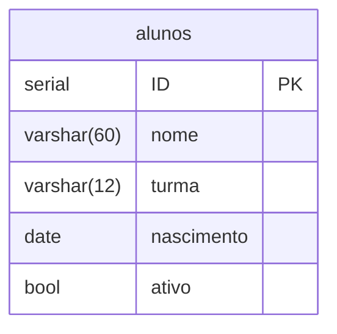

# O basico de BD
## Comandos que eu não vou esquecer:

## 1. Acessar o postgres por CLI:

- Usando o usuario do linux (PAM):
``` bash
sudo -u postgres psql -h localhost 
```
- utilizando usuario do postgres:
```bash
psql -U *usuario* -h localhost -d *banco_app* 
```
---
## 2. Gerenciando banco de dados:
 - criando banco de dados
```sql
CREATE DATABASE nome_do_banco;
```
 - alterar proprietario do banco:
```sql
ALTER DATABASE nome_do_banco OWNER TO nome_user;
```

 - apagar banco de dado:
```sql
DROP DATABASE nome_do_banco;
```
 - Lista todos so bancos:

``` bash
\l
``` 

---

## 3. Gerenciando usuarios no banco de dados:

 - criando um usuario  e senhe para o usuario no postgres:
```sql
 CREATE USAR nome_user WITH PASSWORD 'senha';
``` 

 - trocando de senha no postgres
``` sql
ALTER USER nome_user WITH PASSWORD  'senha1';
```
 - trocando o nome de usuario:
``` sql
ALTER USER nome_user WITH NAME = novo_nome;
```
 - Apagar usuario:
``` sql
DROP USER nome_user;
```

## 4. Gerenciando Tabelas (Tables):

#### A. Criar Tabela (`CREATE TABLE`)
Define a estrutura da tabela, colunas, tipos de dados e restrições (*constraints*).

```sql
CREATE TABLE clientes (
    id SERIAL PRIMARY KEY,
    nome VARCHAR(60) NOT NULL,
    cpf VARCHAR(11) UNIQUE NOT NULL,
    telefone VARCHAR(15),
    ativo BOOLEAN DEFAULT true,
    criado_em TIMESTAMP DEFAULT CURRENT_TIMESTAMP
);

CREATE TABLE vendas (
    id SERIAL PRIMARY KEY,
    data DATE DEFAULT CURRENT_DATE,
    id_cliente INT REFERENCES clientes(id)
);
```

#### B. Alterar Tabela (`ALTER TABLE`)
Modifica a estrutura de uma tabela existente sem apagar os dados existentes.

- **Adicionar coluna:**
```sql
ALTER TABLE clientes ADD COLUMN email VARCHAR(100);
```

- **Remover coluna:**
```sql
ALTER TABLE clientes DROP COLUMN telefone;
```

- **Renomear coluna:**
```sql
ALTER TABLE clientes RENAME COLUMN sobre_nome TO sobrenome;
```

- **Alterar tipo de dado de uma coluna:**
```sql
ALTER TABLE clientes ALTER COLUMN nome TYPE VARCHAR(100);
```

- **Renomear a tabela:**
```sql
ALTER TABLE clientes RENAME TO meus_clientes;
```

#### C. Apagar Tabela (`DROP TABLE`)
Remove a tabela e todos os seus dados permanentemente.

```sql
DROP TABLE clientes;

-- Evita erro caso a tabela não exista:
DROP TABLE IF EXISTS clientes;

-- Remove a tabela e todas as tabelas/chaves estrangeiras associadas a ela:
DROP TABLE clientes CASCADE;
```

#### D. Limpar Dados (`TRUNCATE TABLE`)
Apaga todos os registros da tabela rapidamente, mantendo sua estrutura intacta.

```sql
TRUNCATE TABLE clientes;

-- Reinicia a contagem do SERIAL (ID volta para 1):
TRUNCATE TABLE clientes RESTART IDENTITY;
```
---

# Guia de Relacionamentos em Banco de Dados

## Relacionamentos

### 1 para 1 (1:1)
Ocorre quando um registro em uma tabela está relacionado a exatamente um registro em outra tabela. É comum para evitar duplicação de dados ou separar informações de acesso, como em uma tabela de **Alunos** e uma de **Alunos da Banda**.

### 1 para muitos (1:N)
É o tipo mais comum, onde um registro em uma tabela pode estar relacionado a vários registros em outra. Isso é estabelecido através de uma chave estrangeira na tabela do "muitos" que referencia a chave primária da tabela do "um", como em **Clientes** e **Pedidos**.

### Muitos para muitos (N:N)
Ocorre quando vários registros de uma tabela se relacionam com vários de outra. Como bancos relacionais não suportam isso diretamente, ele é implementado por meio de uma tabela associativa (ou intermediária) que cria dois relacionamentos 1:N, como em **Pedidos** e **Produtos**.

---

## Perguntas para Relacionar Entidades de Banco de Dados

> **Dica:** Ao analisar o relacionamento entre tabelas, siga o fluxo de perguntas abaixo:

1. **Identificar a tabela primária:** Focar na tabela primária (ex: `Cliente`)
2. **Identificar a tabela secundária:** Quem é a tabela secundária?
3. **Mapear a cardinalidade:** Quantas vezes a tabela secundária terá dados da tabela primária?


## 4 Modelagem de dados

 - Armazenar informação/Dados relevantes á aplicação
 
 - Representar o mundo real em "tabelas" relacionados
 
 - Utilizar para análises (consiltas/Query)
 
 - Modelo conceitual (Entidades e atributos)
    - Relacionamento
 - Modelo lógico => Detalhes do modelo conceitual(Relacionamentos/tipos de dados)

 - Modelo Físico (SGBD-SQL)  

### Entidades:

    Pessoa => atributos: Nome, CPF;

    Cliente => Pessoa, Empresa;

    Loja;

    Empresa;

---

**MER** - Modelo Entidade Relacionamento
 -
 - É um modelo que descreve os objtos envolvidos(entidade) em um negocio, com suas caracteristicas(atributos) e como elas se relacionam entre si(relacionamentos)


**DER** - Diagrama Entidade Relacionamento 
 -
 - Também conhecido como diagrama ER, é uma representação visual que ilustra como as entidades (pessoas, objetos ou conceitos) interagem e se relacionam dentro de um sistema de banco de dados. 

---

# Revisao previa de login com linux e pelo postgres no banco de dados

## Operações Principais (CRUD)

> - **C**reate (`INSERT`): Inserir dados
> - **R**ead (`SELECT`): Consultar/Ler dados 
> - **U**pdate (`UPDATE`): Atualizar dados 
> - **D**elete (`DELETE`): Remover dados 


## login postegresql
 1. usando o usuário linux:
 ```bash
 sudo -u postgres psql
 ```
**nunca** utilizar o postres para gerenciamento de bancos e tabelas. (Não utilizar na aplicação).
 2. usando usuario postgres:
 ```sql
 psql -U escola -h localhost -d escola
 ```

## Gerenciamento de databases
 1. Criando um database
 ```sql
 CREATE DATABASE escola;
 ```
 2. Alterando database:
 ```sql
 ALTER DATABASE escola OWNER TO escola;
 ```
 3. Apagando um database:
 ```sql
 DROP DATABASE nome_banco;
 ```

## GErenciamento de usuario:
 1. Criando usuário:
 ```sql
 CREATE USER escola WITH PASSWORD 'escola';
 ```
 2. Alterando usário :
 ```sql
 ALTER USER escola WITH PASSWORD 'senha2';
 ```

---

## Diagrama da tabela:



---

