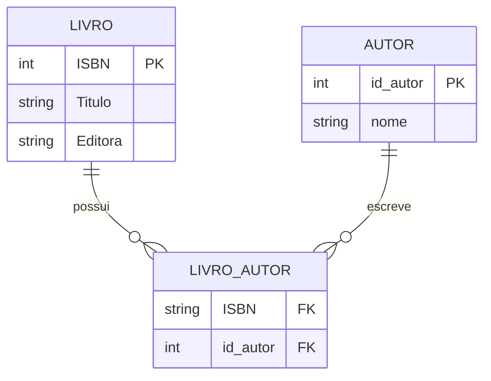

# segundo exercicio, criando tabela para Catálogo de Livros e Autores

```mermaid
    erDiagram
        LIVRO{
            int ISBN PK 
            string Titulo 
            string Editora 
        }
        AUTOR{
            int id_autor PK 
            string nome 
        }

        LIVRO_AUTOR{
            string ISBN FK 
            int id_autor FK
        }


LIVRO ||--o{ LIVRO_AUTOR:"possui"
AUTOR ||--o{ LIVRO_AUTOR:"escreve"
``` 
