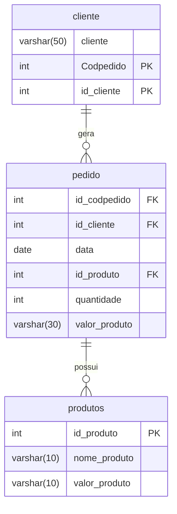

```mermaid
    erDiagram
        cliente{
            varshar(50) cliente 
            int Codpedido PK 
            int id_cliente PK 
        }
        produtos{
            int id_produto PK
            varshar(10) nome_produto 
            varshar(10) valor_produto 

        }
        pedido{
            int id_codpedido FK
            int id_cliente FK 
            date data 
            int id_produto FK 
            int quantidade 
            varshar(30) valor_produto 
          
        }
cliente ||--o{ pedido:"gera"
pedido||--o{produtos :"possui"
```