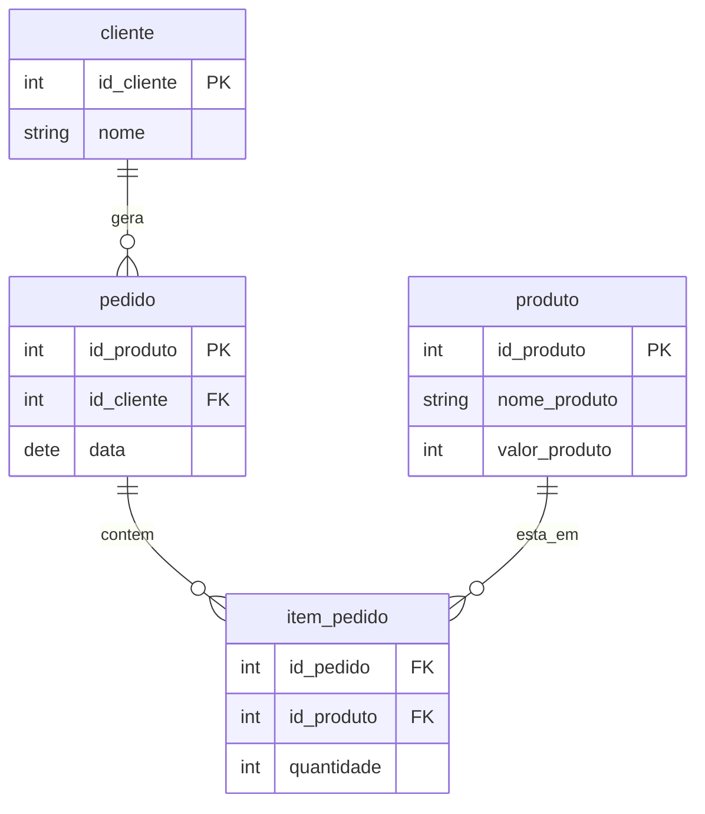

```mermaid
    erDiagram
        cliente{
            int id_cliente PK 
            string nome
        }
        pedido{
            int id_produto PK
            int id_cliente FK
            dete data

        }
        produto{
            int id_produto PK
            string nome_produto
            int valor_produto
        }
        item_pedido{
            int id_pedido FK
            int id_produto FK
            int quantidade
        }

cliente ||--o{ pedido :"gera"
pedido||--o{ item_pedido :"contem"
produto ||--o{item_pedido : "esta_em"
```