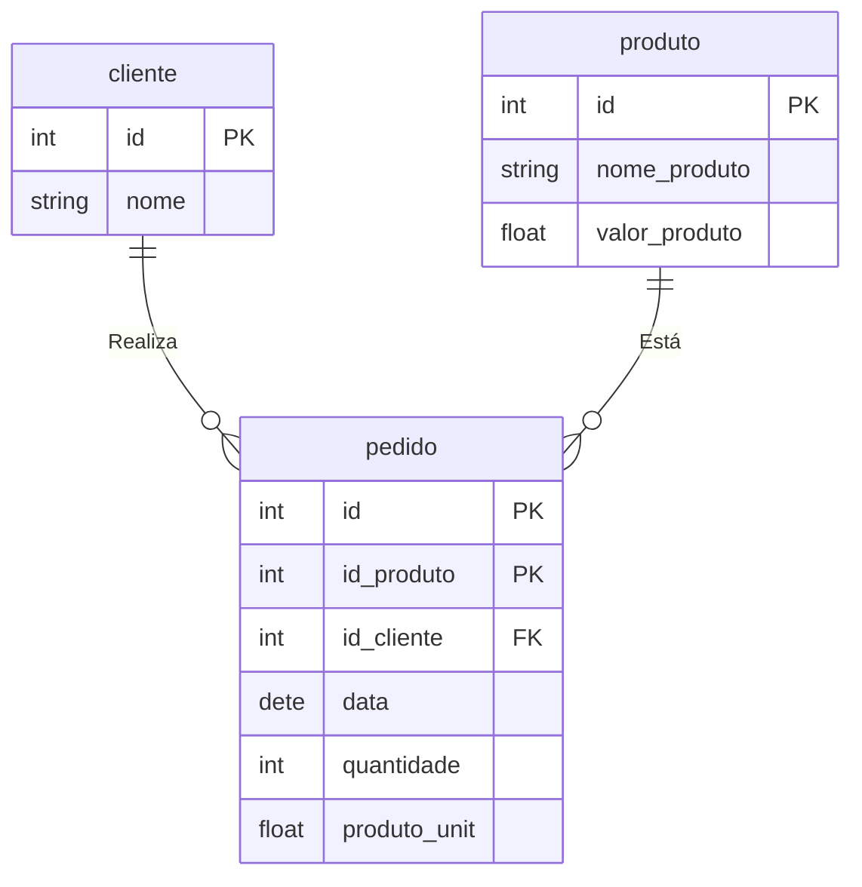

# terceiro exercicio, criando tabela para Itens de um Pedido

```mermaid
    erDiagram
        cliente{
            int id PK 
            string nome
        }
        produto{
            int id PK
            string nome_produto
            float valor_produto
        }
        pedido{
            int id PK
            int id_produto PK
            int id_cliente FK
            dete data
            int quantidade
            float produto_unit
        }

cliente ||--o{ pedido :"Realiza"
produto ||--o{ pedido :"Está"

```