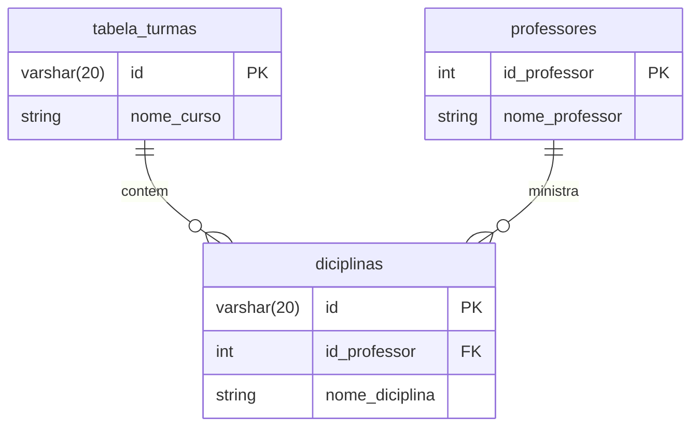

---

```mermaid
    erDiagram
    CURSO {
        int id_curso PK
        string nome_curso
    }

    TURMA {
        string id_turma PK
        int id_curso FK
    }

    DISCIPLINA {
        int id_disciplina PK
        int id_curso FK
        string nome_disciplina
    }

    PROFESSOR {
        int id_professor PK
        string nome_professor
    }

    TURMA_DISCIPLINA_PROFESSOR {
        string id_turma FK
        int id_disciplina FK
        int id_professor FK
    }

    CURSO ||--o{ TURMA : "oferta"
    CURSO ||--o{ DISCIPLINA : "grade"
    TURMA ||--o{ TURMA_DISCIPLINA_PROFESSOR : "possui"
    DISCIPLINA ||--o{ TURMA_DISCIPLINA_PROFESSOR : "é_ministrada"
    PROFESSOR ||--o{ TURMA_DISCIPLINA_PROFESSOR : "leciona"