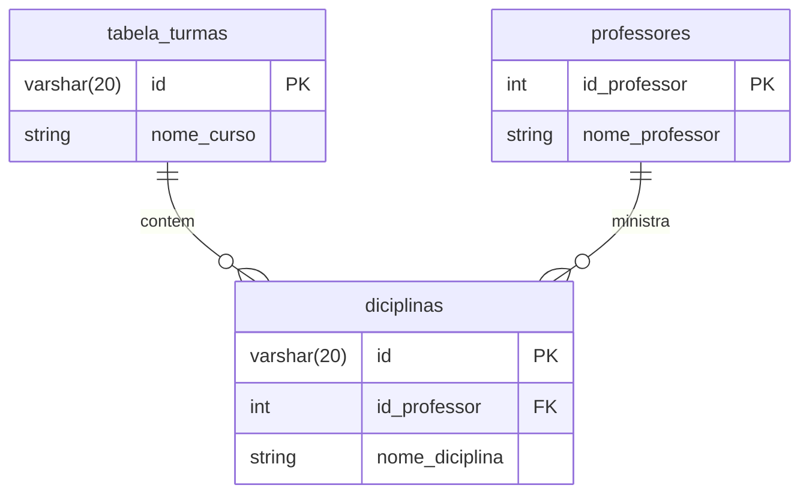

```mermaid
    erDiagram
    tabela_turmas{
        varshar(20) id PK 
        string nome_curso  
    }

    professores{
        int id_professor PK 
        string nome_professor 

    }
    diciplinas{
        varshar(20) id PK 
        int id_professor FK 
        string nome_diciplina 
    }


    tabela_turmas||--o{diciplinas:"contem"
    professores||--o{diciplinas:"ministra"
```