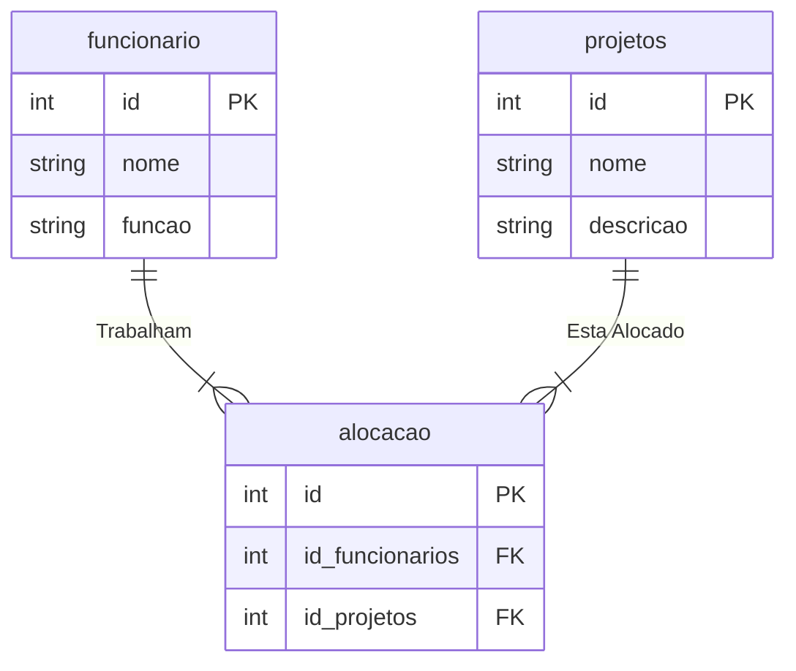
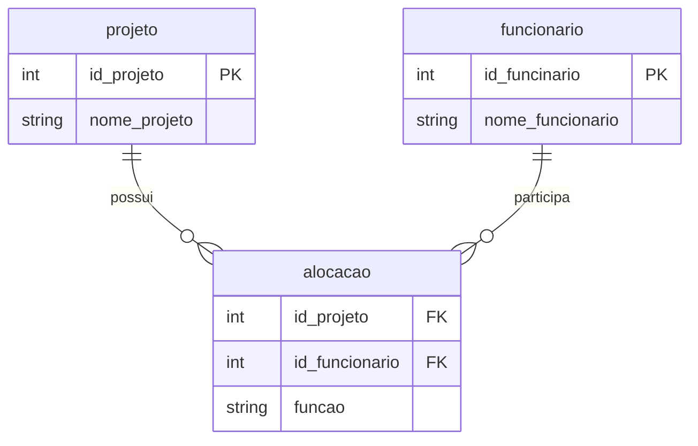

# quinto exercicio, criando tabelas para Gestão de Projetos (Equipes)

## Aqui é a solução do porfessor

```mermaid
    erDiagram
        funcionario{
            int id PK
            string nome
            string funcao
        }
        projetos{
            int id PK
            string nome
            string descricao
        }
        alocacao{
            int id PK
            int id_funcionarios FK
            int id_projetos FK
        }

funcionario ||--|{ alocacao:Trabalham
projetos ||--|{alocacao:"Esta Alocado"
```

## aqui foi o que eu fiz

``` mermaid
    erDiagram
    projeto{
        int id_projeto PK 
        string nome_projeto 
    }

    funcionario{
        int id_funcinario PK
        string nome_funcionario
    }

    alocacao{
        int id_projeto FK 
        int id_funcionario FK 
        string funcao 
        

    }
    projeto ||--o{ alocacao : "possui"
    funcionario ||--o{ alocacao : "participa"
```